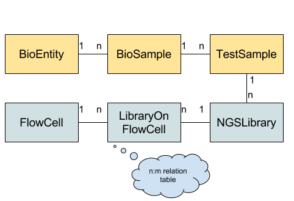

.. _high_level_overview:

===================
High-Level Overview
===================

The figure below gives an overview of the overall data schema.
Each box represents a table while the connections and labels specify the relation counts between them.
The “core” schema is shown in yellow while the NGS-specific part is shown in blue.

    Tables used in the BioMed Sheet data schema.

**BioEntity** describes biological entities (or specimens or donors).
This might be a human patient, a mouse, a cell culture, etc.
**BioSample** describes one biological sample taken from the biological entity.
This might be a blood sample, saliva swab, part of a primary tumor biopsy, part of a metathesis biopsy etc.
**TestSample** describes a further processing of a BioSample, e.g., extracted DNA, RNA, etc. from a tumor biopsy.
This data schema is taken from the Qbic tool by Sven Nahnsen’s group.

This data schema has the nice property that it models most of the relevant parts of many studies which are later analyzed by Bioinformaticians.
For example, BioEntity records could describe cancer patients, BioSample describes the healthy samples and tumor biopsies taken from them (multiple samples can be modeled, e.g., for several saliva swabs at different time points, multiple biopsies, e.g., the primary tumor before regression, primary tumor after regression, and several metastases).
TestSample then describes the result of the preparation of the sample, e.g., multiple DNA or RNA extractions can be modeled.
Being able to describe multiple BioSamples and TestSamples has the advantage that certain batch effects as well as test- and sample-specific effects can be later taken into consideration based on the available meta data.

On the other hand, there are certain things that are not directly modeled, e.g., the link and order between tumors before and after regression is not modeled in the primary data schema.
However, **arbitrary meta data** can be attached to each record and then be interpreted by a particular workflow.

Thus, the proposed data schema is useful enough such that generic software libraries can be written that can then be used for modeling many important specific cases and adjusted to the environment of its users.

For the NGS specialization, **NGSLibrary** represents on library prepared for sequencing (e.g. WES, WGS, RNA library).
The various steps in the wet lab protocols are not modeled explicitely but each library record could be annotated by the user if he needs this information in a downstream analysis.
FlowCell represents one flow cell run on a specific machine while **LibraryOnFlowCell** allows for assigning one library to multiple lanes on a given **FlowCell**.

Using this schema, possible flow cell--specific or lane-specific biases can later be incorporated into an analysis.
In terms of mapping to files, each LibraryOnFlowCell then corresponds to one compressed FASTQ file in the case of single-end reads and two compressed FASTQ files in the case of paired reads (at least for bcl2fastq v2, it might correspond to a multiple ones when using v1).

----------------------------------
Sample Sheets vs. Database Schemas
----------------------------------

One important point here is the relation and separation between sample sheets and database schemas.

The aim of the sample sheets is to provide a useful computer-readable description of an experiment for processing the data with Bioinformatics workflows or further downstream analyses (e.g. in R or using Jupyter notebooks).
This document describes a concept for such schemas and an implementation using JSON for the file format (plus a more human-focused TSV representation).

Of course, sample sheets could also be stored in a RDBMS (Relational database management system, e.g., Postgres), with a suitable database schema.
Often such databases would be part of a LIMS system.
A sample sheet could serve as a poor Bioinformatician's LIMS system, if only some meta information for samples and their relation is to be tracked.
However, the more complex part of such a LIMS system or even a hospital information management system are mostly not of direct relevance to the Bioinformatics analysis.

Rather, the data from a laboratory or hospital IT system can be used to generate biomedical sample sheets.
BioMed sample sheets further allow linking back from the bio entities, bio samples, test samples, ngs libraries to such systems by storing lists of URLs for each of the previous entities.
